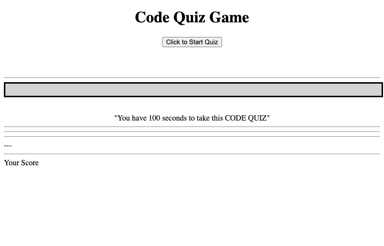
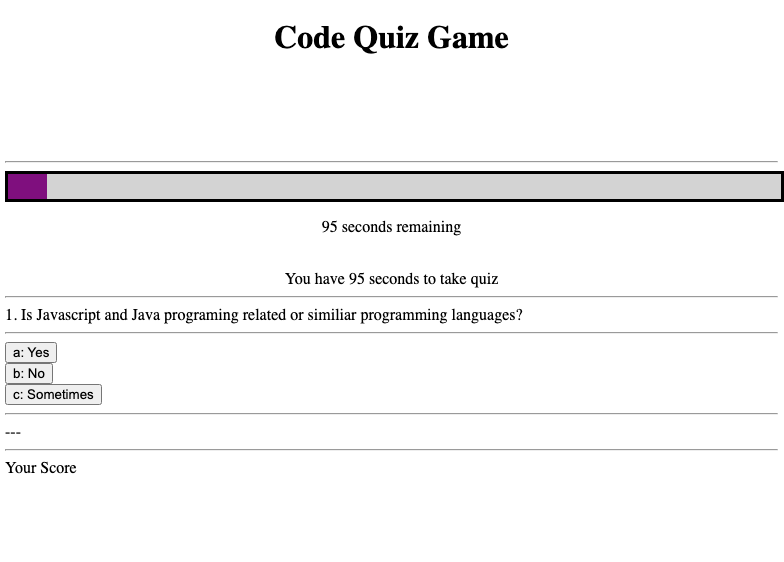
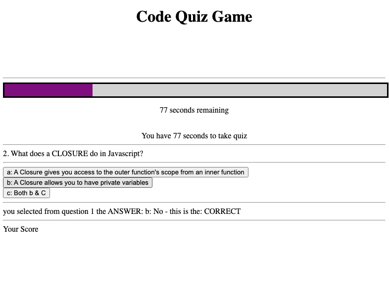
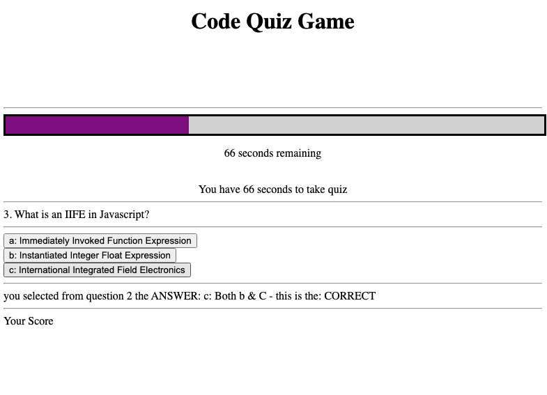
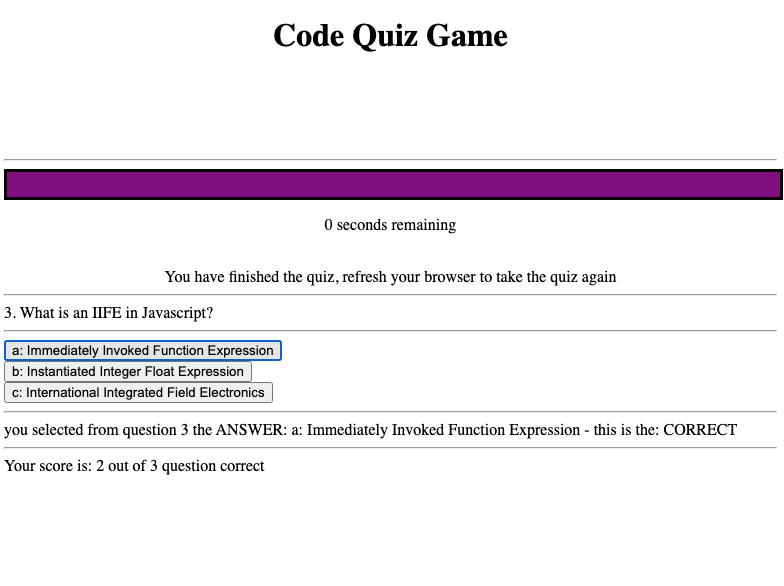

# 4-codeQuizHW_PAC
# HW #4: Code Quiz
# Due: Thursday, December 3, 2020 @ 11:59pm Local

## User Story
This application will run through a series of questions that you can answer within a time period set to 100 seconds.
1. Questions are base on the javascript language
2. There are 3 multiple choice questions
3. Each question has 3 possible answers that you can click to select the answer
4. Upon answering each question, you will be prompted if you answer is correct or incorrect and the next question will appear
5. Any Incorrectly answered questions will deduct 10 seconds off the clock time & is reflected accordinly in the graphical progress bar
6. The Quiz is over when the time runs out or when all the questions have been answered
7. When the Quiz is over, your score will be shown

## There are 4 files in this application:
* index.html
* gameLogic.js
* style.css
* README.md
  

---
---
## Acceptance Criteria

## Using Vanilla Javascript, this application is coded from scratch to meet the following Acceptance Criteria:
1. WHEN I click the start button - THEN a timer starts and I am presented with a question. (CONFIRMED)
2. WHEN I answer a question - THEN I am presented with another question. (CONFIRMED)
3. WHEN I answer a question incorrectly - THEN time (10 seconds) is subtracted from the clock. (CONFIRMED)
4. WHEN all questions are answered or the timer reaches 0 - THEN the game is over and score is shown (CONFIRMED)
5. WHEN the game is over - THEN I can save my initials and scores. (CONFIRMED)
6. WHEN I enter information into the input form, my information is saved within the local browser cache (CONFIRMED)
7. WHEN I refresh the browser tab, the stored scores information remains - persisting in local storage (CONFIRMED)

 
 

## Screen Shots of the Application:

 
 

## NOTES:
* > This code is heavly commited - much complexity in such a simple game
 

---
---
## gitHub repo link & live web link:
 

* `Application GitHub Repo URL:`
https://github.com/streamingTurtles/4-codeQuizHW_PAC 

* `Application Live GitHub URL:`  https://streamingturtles.github.io/4-codeQuizHW_PAC/

- - -
- - -
Peter Cardillo, Columbia Engineering Fullstack Bootcamp, 2020-2021